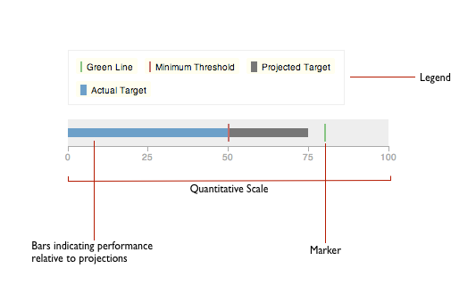

## jQuery Widget Factory Demo

You should read the source in this repo alongwith the article on [NetTuts+](http://net.tutsplus.com/tutorials/javascript-ajax/an-in-depth-review-of-jquerys-widget-factory/)

Some of the highlights from this article include:

- Lifecyle of jQuery Widgets
- Widget Factory API to handle lifecycle events: `_create`, `_init`, `_setOption`, `_destroy`
- The BulletChart example to explain the API
- Extending jQuery Widgets
- Handling events 
- Advanced tips about jQuery Widgets
